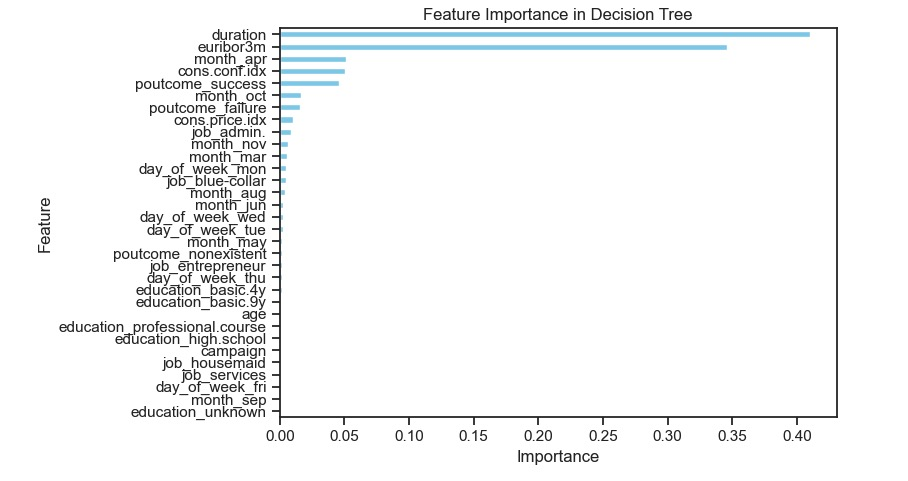

## Precision Marketing for Bank Deposits

## Table of Contents

1. [Objective](#objective)

    -   [Key Performance Metrics](#key-performance-metrics)

    -   [Project Scope](#project-scope)

2.  [Executive Summary](#executive-summary)

    -   [Key Factors Considered](#key-factors-considered)

    -   [Key Insights and Implications](#key-insights-and-implications)

    -   [Evaluation Summary](#evaluation-summary)

3.  [Recommendation](#recommendation)

4.  [Feature Importance in hyperparameter-tuned Decision Tree vs. Logistic Regression](#feature-importance-in-hyperparameter-tuned-decision-tree-vs-logistic-regression)

5.  [GitHub Repository](#github-repository)

6.  [Deep Dives: Unveiling Insights with the CRISP-DM Framework](#deep-dives-unveiling-insights-with-the-crisp-dm-framework)

    -   [Business Use Case: Targeted Marketing Campaign for Bank Term Deposits](#business-use-case-targeted-marketing-campaign-for-bank-term-deposits)

    -   [Understanding Data and Task](#understanding-data-and-task)

    -   [Data Preparation](#data-preparation)

    -   [Data Preprocessing](#data-preprocessing)

    -   [Iterative Modeling and Evaluations](#iterative-modeling-and-evaluations)

7.  [Conclusions and Future Work](#conclusions-and-future-work)

## Objective

The primary goal of this project is to develop a predictive model for banking client subscriptions that balances high predictive accuracy with minimizing the number of contacts during its marketing campaigns. This approach is expected to enhance resource allocation, reduce unnecessary outreach, and improve client engagement.

### Key Performance Metrics

To achieve this objective, the model should:

-   **Accurately Predict Client Subscriptions**: Ensure high predictive accuracy and correctly identify clients who will subscribe.

-   **Minimize Unnecessary Contacts:** Reduce false positives to limit the number of clients contacted unnecessarily.

The model should strike a balance between high precision to reduce unnecessary contacts and high recall to ensure successful subscriptions are correctly identified. The goal is to retain or improve the key performance metrics - **F1 score** and **PR AUC scores** that were observed before any hyperparameter tuning or decision threshold adjustments. This ensures that the model continues to perform well in terms of accuracy and efficiency. **ROC AUC** is also considered as an evaluation metric here for measuring the model’s overall performance.

**F1-Score**: This metric balances precision and recall, providing a comprehensive measure of the model’s ability to correctly identify subscribers while minimizing false positives.

**Area Under the Precision-Recall Curve (PR AUC Score)**: This metric captures the trade-off between precision and recall across different thresholds, providing a single value that reflects both aspects. This score shows a good balance for the positive class and helps in evaluating the model’s overall effectiveness.

**Area Under the ROC Curve (ROC AUC Score)**: Although less focused on the balance between precision and recall, the ROC AUC metric indicates the model’s ability to distinguish between classes and provides additional insights into the model’s performance.

### Project Scope

In this project, we intend to compare the performance of classifiers: K-Nearest Neighbors, Logistic Regression, Decision Trees, and Support Vector Machines. We use a multivariate dataset related to marketing bank products via telephone to predict whether a client will subscribe to a term deposit (variable y). This dataset falls under the business subject area and focuses on predicting client subscriptions based on various features. This dataset is based on ["Bank Marketing" UCI dataset](http://archive.ics.uci.edu/ml/datasets/Bank+Marketing).

## Executive Summary

### Key Factors Considered

-   **Optimizing Resource Allocation:** The model should accurately identify high-potential clients, allowing targeted marketing efforts and making campaigns more cost-effective.

-   **Reducing False Positives:** Enhancing model precision helps lower the number of clients contacted who are unlikely to subscribe, avoiding unnecessary outreach and streamlining the marketing process.

-   **Enhancing Client Experience:** Fewer, more relevant communications improve client experience, reduce fatigue, and increase marketing effectiveness.

-   **Model Performance and Trade-Offs:** The model needs to balance a high F1 score, which reflects accurate subscription predictions, with minimizing ineffective contacts. This balance ensures marketing efforts are both accurate and efficient.

-   **Feature Importance:** Key features are expected to be identified as these are crucial for refining predictions and minimizing unnecessary contacts, ultimately enhancing model's performance metrics.

### Key Insights and Implications

The input dataset is highly imbalanced, with 88.73% of instances labeled as 'no' and only 11.27% as 'yes' for positive client subscriptions. This imbalance impacts the model's ability to accurately predict the minority 'yes' class. To address this issue, technique such as [SMOTE resampling](https://arxiv.org/abs/1106.1813) was employed to enhance the model's performance and ensure effective identification of both majority and minority classes.

SMOTE resampling was applied to both the entire dataset and just the training data to compare model performance. Applying SMOTE to the entire dataset improved the test scores but led to high training and validation scores, indicating overfitting and poor generalization. In contrast, applied [SMOTETomek](https://imbalanced-learn.org/stable/references/generated/imblearn.combine.SMOTETomek.html) (sampling strategy = 0.5) just to the training data, and combined SMOTE's oversampling of the minority class and Tomek links' under-sampling. This created a more balanced training dataset subsequently leading to more realistic estimates of model(s) performance on the test dataset that suggested better generalization and less overfitting. Given this observation, the rest of the findings are based on using SMOTE resampling exclusively on the training data.

Additionally, data analysis revealed that there were no significant linear relationships between the predictor input features, suggesting that the relationships among features are complex and non-linear. This insight was factored into the final model recommendation.

### Evaluation Summary

After evaluating the performance of Logistic Regression, Decision Tree, and Support Vector Classifier (SVC) models through iterative (refer Figure1, Figure2, Figure3) hyperparameter tuning and decision threshold adjustments, the following findings stand out based on the need to accurately predict client subscriptions and minimize unnecessary contacts:

1.  **Best Performing Models:**

    -   **Hyperparameter-Tuned Decision Tree:** Achieved the highest F1 score, which is essential for balancing precision and recall—key for both accurately predicting client subscriptions and minimizing unnecessary contacts. This model also has the advantage of faster training and prediction times, making it suitable for real-time applications.

    -   **Basic SVC Model:** Initially demonstrated the best balance between F1 score, PR AUC, and ROC AUC, contributing to accurate predictions. However, fine-tuning the decision threshold resulted in a lower F1 score, and its longer training time makes it less ideal for deployment.

    -   **Hyperparameter-Tuned Logistic Regression:** While offering the best PR AUC and ROC AUC scores, which reflect strong performance in distinguishing between classes, its F1 score is slightly lower than the Decision Tree. It still performs well in reducing false positives but is slower to train and predict.

2.  **Impact of Threshold Tuning:**

    -   Fine-tuning the decision thresholds for all models to maximize the F1 score resulted in lower F1 scores, suggesting that this step does not improve performance in terms of reducing false positives or enhancing predictive accuracy and should be discarded.

3.  **Training Speed and Efficiency:**

    -   The Decision Tree model is the fastest to train and predict, an important consideration when scaling up predictions for large datasets or when quick decisions are needed for client subscription campaigns.

    -   The basic SVC model takes considerably longer to train and predict, making it less feasible for time-sensitive applications, despite its initial strong performance in client subscription prediction.

    -   The Logistic Regression model performs well in terms of PR AUC and ROC AUC but lags behind in training speed compared to the Decision Tree.

4.  **Interpretability:**

    -   Both the Decision Tree and Logistic Regression models offer clear insights into feature importance and decision-making processes, which is helpful for understanding how the model is predicting client subscriptions. The SVC model, while effective in some cases, lacks intuitive interpretability, making it harder to explain predictions to stakeholders.

5.  **Feature Importance in Decision Tree vs. Logistic Regression:**

    -   Decision Tree Model: Features like "duration" (0.410) and "euribor3m" (0.346) are straightforward indicators of client subscription likelihood. The model’s structure helps minimize unnecessary contacts by focusing on these critical factors, ensuring that marketing efforts are effectively targeted.

    -   Logistic Regression Model: Provides detailed coefficients for features such as "Cons. Price Index" (2.707556) and "Month_Oct" (2.433611), which indicate how various factors influence subscription probability. Positive coefficients signal high likelihood, while negative coefficients help avoid less promising contacts. This nuanced view aids in optimizing marketing strategies by targeting high-potential clients and reducing unnecessary outreach.

Figure1: Basic Model Comparison with no tuning. In this comparison, the Support Vector Classifier (SVC) model demonstrates superior performance with a higher F1 score compared to the Logistic Regression model. However, the Logistic Regression model shows competitive performance with similar F1 scores, and it outperforms the SVC model in both Precision-Recall AUC (PR AUC) and ROC AUC scores. Additionally, the Logistic Regression model offers advantages in terms of interpretability and efficiency, consuming less time for both training and prediction.

Figure2: Model Comparison with Hyper-Parameter tuning. With hyperparameter tuning using GridSearchCV or RandomizedSearchCV. The Decision Tree model achieves the highest F1 score, followed by the Logistic Regression model. However, Logistic Regression outperforms the Decision Tree in both Precision-Recall AUC (PR AUC) and ROC AUC scores. Both models offer good interpretability, with the Decision Tree being more computationally efficient. On the other hand, the Support Vector Classifier (SVC), with hyperparameter tuning, records the lowest F1, PR AUC, and ROC AUC scores.

Figure3: Model Comparison with Hyper-Parameter and Decision Threshold tuning to maximize F1 score. After additional tuning of decision thresholds to maximize the F1 score, the best estimators from GridSearchCV or RandomizedSearchCV were used for the Logistic Regression, Decision Tree, and SVC models. The SVC model was fine-tuned for its decision threshold with both the basic (non-hyper-tuned) model and the best estimator from hyperparameter tuning, as the basic SVC model initially showed the best performance, achieving a high F1 score along with well-balanced PR AUC and ROC AUC scores before hyper=parameter tuning. When optimizing for a higher F1 score, the hyperparameter-tuned Decision Tree model (without adjusting the decision threshold) achieves the highest F1 score. This is followed by the basic (non-hyper-tuned) SVC model, and then the hyperparameter-tuned Logistic Regression model. However, fine-tuning the decision threshold to maximize the F1 score actually lowered the F1 score across all models, suggesting that this step can be discarded.

### Recommendation

Deploy the hyperparameter-tuned Decision Tree model (Figure4, Figure5) in Production. It provides the best balance between F1 score, computational efficiency, and accurate prediction of client subscriptions while minimizing unnecessary contacts.

Although the Logistic Regression model (Figure6, Figure7) has better PR AUC and ROC AUC scores, the Decision Tree’s superior speed and F1 score with its ability to handle complex and non-linear relationships among predictors make it the more practical choice for deployment. The Decision Tree’s focus on critical features like "duration" and "euribor3m," alongside the Logistic Regression model’s detailed coefficient insights, ensures alignment with both high predictive performance and effective contact reduction strategies.

Figure4: Classification Report and best hyper-parameters for recommended Decision Tree classifier

Figure5: Confusion Matrix, PR AUC and ROC AUC curve for recommended Decision Tree

Figure6: Classification Report and best hyper-parameters for Logistic Regression classifier

Figure7: Confusion Matrix, PR AUC and ROC AUC curve for tuned Logistic Regression classifier

 

### Feature Importance in hyperparameter-tuned Decision Tree vs. Logistic Regression

To optimize marketing strategies, focus on the key features and interactions that drive client subscriptions:

#### **Decision Tree Model**

**Top Features:**

-   **Duration (0.410):** Highest importance, indicating that the length of the call is a strong predictor of client subscription likelihood.

-   **Euribor3m (0.346):** Significant predictor, reflecting the impact of the 3-month Euribor rate on subscription probability.

-   **Month_Apr (0.051) and Cons. Conf. Index (0.051):** Moderate importance, showing some influence based on the month of contact and consumer confidence.

**Predictive Performance:**

The model’s ability to accurately classify clients and minimize unnecessary contacts is driven by its high-importance features. It efficiently directs marketing efforts by making clear decisions based on feature splits.

**Minimizing Contacts:**

By focusing on features like "duration" and "euribor3m," the Decision Tree helps to identify clients more likely to subscribe, thereby reducing the number of unnecessary contacts.

#### **Logistic Regression Model with L2 Regularization**

**Top Features with Positive Coefficients:**

-   **Cons. Price Index (2.707556):** High positive coefficient, indicating a strong positive effect on the likelihood of subscription. Higher values of this feature significantly increase the probability of subscription.

-   **Month_Oct (2.433611):** High positive coefficient, showing that contacts made in October are strongly associated with a higher likelihood of subscription.

-   **Cons. Conf. Index^6 (2.380486):** A high positive coefficient on this transformed feature suggests that very high levels of consumer confidence have a strong positive effect on subscription likelihood.

-   **Cons. Price Index^2 (1.593425):** Indicates that higher squared values of the cons. price index contribute positively, showing that increases in this feature’s squared term further raise the likelihood of subscription.

**Top Features with Negative Coefficients:**

-   **Cons. Price Index^6 (-2.886025):** High negative coefficient, suggesting that very high values of this feature decrease the likelihood of subscription. Extreme values in this feature can lower subscription probabilities.

-   **Month_May (-1.733885):** Negative coefficient shows that contacts made in May are associated with a lower probability of subscription, indicating this month is less favorable for successful subscriptions.

-   **Duration^2 Cons. Price Index^4 (-1.525438):** Complex interaction where higher values in both the duration and cons. price index raised to the fourth power lead to a decreased likelihood of subscription, suggesting that very long calls combined with high cons. price index values can negatively impact subscription chances.

-   **Predictive Performance:** The model’s coefficients provide insights into how each feature and its transformations influence subscription probabilities. For instance:

-   **Cons. Price Index (2.707556)** and **Month_Oct (2.433611)** have strong positive effects, meaning clients with higher cons. price index values or those contacted in October are more likely to subscribe.

-   **Cons. Price Index^2 (1.593425)** further amplifies the effect of this feature, indicating that increases in the cons. price index have a compounded positive impact on subscription probability.

**On the other hand:**

-   **Cons. Price Index^6 (-2.886025)** and **Month_May (-1.733885)** show strong negative effects, helping to identify and avoid less promising clients, thus improving targeting efficiency.

-   **Duration^2 Cons. Price Index^4 (-1.525438)** demonstrates that extreme values in both features combined reduce subscription likelihood, guiding the model to avoid these less favorable scenarios.

Figure8: Features in use by recommended Decision Tree classifier

Figure9: Top Positive and Negative Features by their coefficients from hyper-tuned Logistic Regression classifier

## GitHub Repository

<https://github.com/diptiaswath/clientSubscriptionPrediction/>

-   Data Set from UCI repo is located [here](https://github.com/diptiaswath/clientSubscriptionPrediction/blob/main/data/bank-additional-names.txt)

-   Visualization Plots for Exploratory Data Analysis before cleaning and after cleaning data-set are located [here](https://github.com/diptiaswath/clientSubscriptionPrediction/tree/main/plots). Credits to [AutoViz library](https://github.com/AutoViML/AutoViz)

-   Results of compared classifiers across multiple iterations are summarized into CSVs located [here](https://github.com/diptiaswath/clientSubscriptionPrediction/tree/main/results)

-   [Jupyter Notebook](https://github.com/diptiaswath/clientSubscriptionPrediction/blob/main/bank_subscriptions.ipynb) is located in the main folder together with [this](https://github.com/diptiaswath/clientSubscriptionPrediction/blob/main/README.md) README.md

Continue reading for an in-depth analysis of the model evaluations that underpins the findings and recommendations discussed above.

## Deep Dives: Unveiling Insights with the CRISP-DM Framework

### Business Use Case: Targeted Marketing Campaign for Bank Term Deposits

A Portuguese banking Institution aims to increase subscriptions to its term deposit products by launching a highly targeted outbound marketing campaign. Using machine learning models, the goal is to identify clients most likely to subscribe, thereby improving conversion rates while minimizing unnecessary contacts, which saves resources and reduces client dissatisfaction.

The institution regularly conducts phone marketing campaigns to promote term deposit subscriptions. However, previous campaigns have resulted in high call volumes with relatively low conversion rates, leading to wasted resources and potential customer dissatisfaction. To address this, a classification model is sought to reduce low conversion rates, minimize operational inefficiencies from unnecessary calls, and prevent damage to client relationships caused by excessive and irrelevant contact.

### Understanding Data and Task

A detailed description of the predictor features can be found in [here](https://github.com/diptiaswath/clientSubscriptionPrediction/blob/main/data/bank-additional-names.txt). The dataset collected is reported to be collected for 17 direct marketing campaigns that occurred between May 2008 and November 2010, corresponding to a total of 41188 contacts. During these phone campaigns, an attractive long-term deposit application, with good interest rates, was offered.

The business objective and key performance metrics, summarized at the start of the report, were refined throughout multiple model iterations. Initially, accuracy score was prioritized but was later deprioritized in favor of focusing on F1 score, to ensure accurate identification of client subscriptions, while minimizing unnecessary contacts.

### Data Preparation

The highly imbalanced [data-set](https://github.com/diptiaswath/clientSubscriptionPrediction/blob/main/data/bank-additional-full.csv) was visualized with AutoViz library. The various plots indicated the presence of: a) duplicate rows, b) high feature correlations between features nr.employed, emp.var.rate and euribor3m, c) no missing valued rows or columns, d) several missing values in some categorical features – job, marital with “unknown” value in them, e) rare category values for education (value of ‘illiterate’), default (value of “yes”), month (value of “dec”), e) outliers for features - duration, campaign, pdays, previous, and cons.conf.index.

As part data preparation, prepared data to: a) clean up duplicate rows, b) filtered out rows with “unknown” values specifically where the number of those samples were minimal, c) dropped two highly correlated features - nr.employed, emp.var.rate, d) re-cleaned duplicate rows after removal of identified outliers.

### Data Preprocessing

Considered features that could be dropped based on their permutation importance.
-   Zero-Importance features: Historical information from previous campaigns - pdays, previous
-   Low- Importance features: month, loan, day_of_week, default, contract
-   Negative-Importance features: education, job, housing, marital

Decided to drop zero and low-importance features: pdays, previous, contract, marital as these were observed to be safe from their [KDE plots](https://github.com/diptiaswath/clientSubscriptionPrediction/blob/main/plots/autoviz_plots_cleaned_data/y/Dist_Plots_Numerics.svg) in addition to their feature importances captured below. 

In subsequent iterations as part of improving model performance, also decided to drop a low and negative importance feature: housing and default. This resulted in 12 predictor variables and 1 target variable, with 40566 entries.

#### Feature Engineering

Numeric Predictors ['age', 'duration', 'campaign', 'cons.price.idx', 'cons.conf.idx', 'euribor3m'] were scaled and certain models specifically, Logistic Regression and KNN Classifiers pre-processed these features with a polynomial transform.

Both Categorical ['education', 'job', 'month', 'day_of_week', 'poutcome'] and Binary predictors ['loan'] were one hot encoded and the target variable ‘y’ was mapped to a numeric 1or a 0, where yes/1 is a positive minority class indicating client will subscribe to a term deposit and the majority class of no/1 indicates client will not subscribe.

#### SMOTE on entire data v.s. SMOTE resampling on only training data

As outlined in the summary, this was needed to work with the highly imbalanced data-set. Models using both were compared and labeled as either Iteration1 and 2 across all four classifiers.

#### Train and Test Split

A 70/30 split where random=442 was applied with a stratify parameter to ensure both the training and test sets have the same ratio of each class as the original dataset.

### Iterative Modeling and Evaluations

**Logistic Regression Classifier:** All iterations of this classifier used Stratified K-Fold cross validation to reduce the risk of overfitting. The iterations with L2 regularization include, a) Iteration1 – evaluation with SMOTE resampled training data, b) Iteration2 – evaluation with SMOTE sampling on entire dataset, c) Iteration3 – evaluation with SMOTE resampled training data and hyper parameter tuning with Randomized Search since Grid Search was computationally expensive and time consuming, d) Iteration4 – evaluation with SMOTE resampled training data with both hyper parameter tuning and decision threshold tuning to maximize F1 score.

The evaluation results are captured below and written to [this CSV file](https://github.com/diptiaswath/clientSubscriptionPrediction/blob/main/results/lgr_all_iterations_summary.csv). Plots that compare the key performance metrics are captured in Figure1, Figure2 and Figure3 in the summary section. Classification reports and Confusion Matrices for each are available in the attached Jupyter notebook.

| **Results Summary: All iterations of Logistic Regression model**                           |                            |                              |                     |                    |                           |                          |                     |                    |                    |                |                 |                |                 |
|--------------------------------------------------------------------------------------------|----------------------------|------------------------------|---------------------|--------------------|---------------------------|--------------------------|---------------------|--------------------|--------------------|----------------|-----------------|----------------|-----------------|
| Model                                                                                      | Average Fit Time (seconds) | Train F1 score (cv)          | Test F1 score (cv)  | Test F1 score      | Train Accuracy score (cv) | Test Accuracy score (cv) | Test Accuracy score | PR AUC score       | ROC AUC score      | True Positives | False Positives | True Negatives | False Negatives |
| Logistic Regression with SMOTE on train                                                    | 0.558314037322998          | 0.8316870608728630           | 0.8297503732432620  | 0.6090580716865800 | 0.8837566102648000        | 0.882474799178917        | 0.8843878389482330  | 0.6603288744967030 | 0.8531646711528940 | 1096           | 1155            | 9667           | 252             |
| Logistic Regression with SMOTE on whole                                                    | 0.7146973609924320         | 0.9394598283450970           | 0.9387128674393960  | 0.941771221103911  | 0.9390978052098630        | 0.9383750591912340       | 0.9414591322829550  | 0.9550821920679900 | 0.9414593819341170 | 10246          | 692             | 10130          | 575             |
| Logistic Regression with SMOTE on train (RandomizedSearchCV)                               | 0.7146973609924320         | 0.8465928629060450           | 0.8450333205210970  | 0.5873846920967340 | 0.8875355299096930        | 0.8863533585827330       | 0.8640098603122430  | 0.6658175572987420 | 0.8620374777831950 | 1178           | 1485            | 9337           | 170             |
|                                                                                            |                            |                              |                     |                    |                           |                          |                     |                    |                    |                |                 |                |                 |
|                                                                                            |                            |                              |                     |                    |                           |                          |                     |                    |                    |                |                 |                |                 |
| **Results Summary: Compare Logistic Regression models with decision threshold fine tuned** |                            |                              |                     |                    |                           |                          |                     |                    |                    |                |                 |                |                 |
| Model                                                                                      | Threshold                  | Test F1 score (at threshold) | PR AUC score        | ROC AUC score      | True Positives            | False Positives          | True Negatives      | False Negatives    |                    |                |                 |                |                 |
| LogisticRegression with SMOTE on train (RandomizedSearchCV)                                | 0.6                        | 0.5873846920967340           | 0.6658175572987420  | 0.8620374777831950 | 1178                      | 1485                     | 9337                | 170                |                    |                |                 |                |                 |
| LogisticRegression (RandomizedSearchCV best estimator) threshold tuned for max F1          | 0.09862493620063760        | 0.5484147386461010           | 0.42128708494436700 | 0.8562920926544290 | 960                       | 1193                     | 9629                | 388                |                    |                |                 |                |                 |

**Decision Tree Classifier:** All iterations of this classifier used Stratified K-Fold cross validation to reduce the risk of overfitting. The iterations include, a) Iteration1 – evaluation with SMOTE sampling on entire dataset, b) Iteration2 – evaluation with SMOTE resampled training data evaluation with SMOTE sampling on entire dataset, c) Iteration3 – evaluation with SMOTE resampled training data and hyper parameter tuning with Grid Search, d) Iteration4 – evaluation with SMOTE resampled training data with both hyper parameter tuning and decision threshold tuning to maximize F1 score.

The evaluation results are captured below and written to [this CSV file](https://github.com/diptiaswath/clientSubscriptionPrediction/blob/main/results/dc_all_iterations_summary.csv). Plots that compare and summarize the key performance metrics are captured in Figure1, Figure2 and Figure3 in the summary section. Classification reports and Confusion Matrices for each are available in the attached Jupyter notebook.

| **Results Summary: All iterations of Decision Tree model**                    |                            |                              |                     |                    |                           |                          |                     |                    |                    |                |                 |                |                 |
|-------------------------------------------------------------------------------------|----------------------------|------------------------------|---------------------|--------------------|---------------------------|--------------------------|---------------------|--------------------|--------------------|----------------|-----------------|----------------|-----------------|
| **Model**                                                                           | Average Fit Time (seconds) | Train F1 score (cv)          | Test F1 score (cv)  | Test F1 score      | Train Accuracy score (cv) | Test Accuracy score (cv) | Test Accuracy score | PR AUC score       | ROC AUC score      | True Positives | False Positives | True Negatives | False Negatives |
| **DecisionTree with SMOTE on train**                                                | 0.14999704360961900        | 0.9995201389558150           | 0.8766936881167160  | 0.4899744804958080 | 0.9176739455472840        | 0.9176739455472840       | 0.8850451930977810  | 0.517891588109558  | 0.7158539835602500 | 672            | 723             | 10099          | 676             |
| **DecisionTree with SMOTE on whole**                                                | 0.18384990692138700        | 0.9997524284291300           | 0.9310178383071750  | 0.933920704845815  | 0.9308104223631590        | 0.9308104223631590       | 0.9334657857043850  | 0.9487390652844090 | 0.9333274992459320 | 10176          | 795             | 10027          | 645             |
| **DecisionTree with SMOTE on train (GridSearchCV)**                                 | 0.10144262313842800        | 0.8775799775727750           | 0.8646177110428650  | 0.6157728706624610 | 0.9174747001297660        | 0.9088808572845290       | 0.8999178307313070  | 0.6270820079471780 | 0.7980582882325100 | 976            | 846             | 9976           | 372             |
|                                                                                     |                            |                              |                     |                    |                           |                          |                     |                    |                    |                |                 |                |                 |
|                                                                                     |                            |                              |                     |                    |                           |                          |                     |                    |                    |                |                 |                |                 |
| **Results Summary: Compare DecisionTree models with decision threshold fine tuned** |                            |                              |                     |                    |                           |                          |                     |                    |                    |                |                 |                |                 |
| **Model**                                                                           | Threshold                  | Test F1 score (at threshold) | PR AUC score        | ROC AUC score      | True Positives            | False Positives          | True Negatives      | False Negatives    |                    |                |                 |                |                 |
| **DecisionTree with SMOTE on train (GridSearchCV)**                                 | 0.6                        | 0.6157728706624610           | 0.6270820079471780  | 0.7980582882325100 | 976                       | 846                      | 9976                | 372                |                    |                |                 |                |                 |
| **DecisionTree (GridSearchCV best estimator) threshold tuned for max F1**           | 0.09862493620063760        | 0.5484147386461010           | 0.42128708494436700 | 0.8562920926544290 | 960                       | 1193                     | 9629                | 388                |                    |                |                 |                |                 |

**K-Nearest Neighbors (KNN) Classifier:** All iterations of this classifier used Stratified K-Fold cross validation to reduce the risk of overfitting. The iterations include, b) Iteration2 – evaluation with SMOTE sampling on entire dataset, c) Iteration3 – evaluation with SMOTE resampled training data and hyper parameter tuning with GridSearch, d) Iteration4 – evaluation with SMOTE resampled training data with both hyper parameter tuning and decision threshold tuning to maximize F1 score.

The evaluation results are captured below and written to [this CSV file](https://github.com/diptiaswath/clientSubscriptionPrediction/blob/main/results/knn_all_iterations_summary.csv). Plots that compare the key performance metrics are captured in Figure1, Figure2 and Figure3 in the summary section. Classification reports and Confusion Matrices for each are available in the attached Jupyter notebook.

| **Results Summary: All iterations of KNN model**                           |                            |                              |                     |                    |                           |                          |                     |                    |                    |                |                 |                |                 |
|----------------------------------------------------------------------------|----------------------------|------------------------------|---------------------|--------------------|---------------------------|--------------------------|---------------------|--------------------|--------------------|----------------|-----------------|----------------|-----------------|
| **Model**                                                                  | Average Fit Time (seconds) | Train F1 score (cv)          | Test F1 score (cv)  | Test F1 score      | Train Accuracy score (cv) | Test Accuracy score (cv) | Test Accuracy score | PR AUC score       | ROC AUC score      | True Positives | False Positives | True Negatives | False Negatives |
| **KNN with SMOTE on train**                                                | 0.012759971618652300       | 0.9058447148428780           | 0.8701632942200310  | 0.5449900652852680 | 0.9329955153757360        | 0.9061979051175690       | 0.8682826622843060  | 0.592713579352367  | 0.7999474364507510 | 960            | 1215            | 9607           | 388             |
| **KNN with SMOTE on whole**                                                | 0.018077993392944300       | 0.9507137027555290           | 0.9341013597460200  | 0.9383843811570840 | 0.9494643489361930        | 0.9317412840600820       | 0.936422861895301   | 0.9472051033821230 | 0.936424334798328  | 10478          | 1033            | 9789           | 343             |
| **KNN with SMOTE on train (GridSearchCV)**                                 | 0.017383384704589800       | 0.9335434365263550           | 0.8768492575545210  | 0.5303668069753460 | 0.9534840464720970        | 0.9116965409979040       | 0.8716516023007400  | 0.5692492521669080 | 0.7765137452173200 | 882            | 1096            | 9726           | 466             |
|                                                                            |                            |                              |                     |                    |                           |                          |                     |                    |                    |                |                 |                |                 |
|                                                                            |                            |                              |                     |                    |                           |                          |                     |                    |                    |                |                 |                |                 |
| **Results Summary: Compare KNN models with decision threshold fine tuned** |                            |                              |                     |                    |                           |                          |                     |                    |                    |                |                 |                |                 |
| **Model**                                                                  | Threshold                  | Test F1 score (at threshold) | PR AUC score        | ROC AUC score      | True Positives            | False Positives          | True Negatives      | False Negatives    |                    |                |                 |                |                 |
| **KNN with SMOTE on train (GridSearchCV)**                                 | 0.6                        | 0.5303668069753460           | 0.5692492521669080  | 0.7765137452173200 | 882                       | 1096                     | 9726                | 466                |                    |                |                 |                |                 |
| **KNN (GridSearchCV best estimator) threshold tuned for max F1**           | 0.09862493620063760        | 0.5484147386461010           | 0.42128708494436700 | 0.8562920926544290 | 960                       | 1193                     | 9629                | 388                |                    |                |                 |                |                 |

**Support Vector Classifier (SVC):** All iterations of this classifier used Stratified K-Fold cross validation to reduce the risk of overfitting. The iterations include, a) Iteration1 – evaluation with SMOTE resampled training data, b) Iteration2 – evaluation with SMOTE sampling on entire dataset, c) Iteration3 – evaluation with SMOTE resampled training data and hyper parameter tuning with Randomized Search since Grid Search was computationally expensive and time consuming, d) Iteration4 – evaluation with SMOTE resampled training data with both hyper parameter tuning and decision threshold tuning to maximize F1 score.

The evaluation results are captured below and written to [this CSV file](https://github.com/diptiaswath/clientSubscriptionPrediction/blob/main/results/svc_all_iterations_summary.csv). Plots that compare the key performance metrics are captured in Figure1, Figure2 and Figure3 in the summary section. Classification reports and Confusion Matrices for each are available in the attached Jupyter notebook.

| **Results Summary: All iterations of SVC model**                           |                            |                              |                     |                    |                           |                          |                     |                    |                    |                |                 |                |                 |
|----------------------------------------------------------------------------|----------------------------|------------------------------|---------------------|--------------------|---------------------------|--------------------------|---------------------|--------------------|--------------------|----------------|-----------------|----------------|-----------------|
| **Model**                                                                  | Average Fit Time (seconds) | Train F1 score (cv)          | Test F1 score (cv)  | Test F1 score      | Train Accuracy score (cv) | Test Accuracy score (cv) | Test Accuracy score | PR AUC score       | ROC AUC score      | True Positives | False Positives | True Negatives | False Negatives |
| **SVC with SMOTE on train**                                                | 45.27653098106380          | 0.8893727556597690           | 0.8768141264346020  | 0.6183310533515730 | 0.919825741820244         | 0.9104481410808420       | 0.8853738701725550  | 0.6201223076378820 | 0.7816271749985060 | 1130           | 1177            | 9645           | 218             |
| **SVC with SMOTE on whole**                                                | 50.587328815460200         | 0.9561124439325450           | 0.9453262361695040  | 0.9495518802550130 | 0.9561525976405160        | 0.9453454679857530       | 0.9495448874924920  | 0.9623092998182360 | 0.9494524275174840 | 10277          | 548             | 10274          | 544             |
| **SVC with SMOTE on train (GridSearchCV)**                                 | 609.6910942077640          | 0.9914250302478760           | 0.9204929723965370  | 0.3583868010999080 | 0.9942552380317240        | 0.9464972845345150       | 0.8849630238290880  | 0.3883420215615050 | 0.5955210207583520 | 391            | 443             | 10379          | 957             |
|                                                                            |                            |                              |                     |                    |                           |                          |                     |                    |                    |                |                 |                |                 |
|                                                                            |                            |                              |                     |                    |                           |                          |                     |                    |                    |                |                 |                |                 |
| **Results Summary: Compare SVC models with decision threshold fine tuned** |                            |                              |                     |                    |                           |                          |                     |                    |                    |                |                 |                |                 |
| **Model**                                                                  | Threshold                  | Test F1 score (at threshold) | PR AUC score        | ROC AUC score      | True Positives            | False Positives          | True Negatives      | False Negatives    |                    |                |                 |                |                 |
| **SVC with SMOTE on train**                                                | 0.6                        | 0.6183310533515730           | 0.6201223076378820  | 0.7816271749985060 | 1130                      | 1177                     | 9645                | 218                |                    |                |                 |                |                 |
| **SVC with SMOTE on train threshold tuned for max F1**                     | 0.09862493620063760        | 0.5484147386461010           | 0.42128708494436700 | 0.8562920926544290 | 960                       | 1193                     | 9629                | 388                |                    |                |                 |                |                 |
| **SVC with SMOTE on train (GridSearchCV)**                                 | 0.6                        | 0.3583868010999080           | 0.3883420215615050  | 0.5955210207583520 | 391                       | 443                      | 10379               | 957                |                    |                |                 |                |                 |
| **SVC (RandomizedSearchCV best estimator) threshold tuned for max F1**     | 0.09862493620063760        | 0.5484147386461010           | 0.42128708494436700 | 0.8562920926544290 | 960                       | 1193                     | 9629                | 388                |                    |                |                 |                |                 |

**Model Comparison with SMOTE resampling on training data across all classifiers**

Located [here](https://github.com/diptiaswath/clientSubscriptionPrediction/blob/main/results/results_summary_with_smote_on_train.csv) with their respective Classification reports and Confusion Matrices in the Jupyter notebook.

| **Model**                                  | **Average Fit Time (seconds)** | **Train F1 score (cv)** | **Test F1 score (cv)** | **Test F1 score**  | **Train Accuracy score (cv)** | **Test Accuracy score (cv)** | **Test Accuracy score** | **PR AUC score**   | **ROC AUC score**  | **True Positives** | **False Positives** | **True Negatives** | **False Negatives** |
|--------------------------------------------|--------------------------------|-------------------------|------------------------|--------------------|-------------------------------|------------------------------|-------------------------|--------------------|--------------------|--------------------|---------------------|--------------------|---------------------|
| **LogisticRegression with SMOTE on train** | 0.558314037322998              | 0.8316870608728630      | 0.8297503732432620     | 0.6090580716865800 | 0.8837566102648000            | 0.882474799178917            | 0.8843878389482330      | 0.6603288744967030 | 0.8531646711528940 | 1096               | 1155                | 9667               | 252                 |
| **KNN with SMOTE on train**                | 0.012759971618652300           | 0.9058447148428780      | 0.8701632942200310     | 0.5449900652852680 | 0.9329955153757360            | 0.9061979051175690           | 0.8682826622843060      | 0.592713579352367  | 0.7999474364507510 | 960                | 1215                | 9607               | 388                 |
| **DecisionTree with SMOTE on train**       | 0.14999704360961900            | 0.9995201389558150      | 0.8766936881167160     | 0.4899744804958080 | 0.9176739455472840            | 0.9176739455472840           | 0.8850451930977810      | 0.517891588109558  | 0.7158539835602500 | 672                | 723                 | 10099              | 676                 |
| **SVC with SMOTE on train**                | 45.27653098106380              | 0.8893727556597690      | 0.8768141264346020     | 0.6183310533515730 | 0.919825741820244             | 0.9104481410808420           | 0.8853738701725550      | 0.6201223076378820 | 0.7816271749985060 | 1130               | 1177                | 9645               | 218                 |

**Model Comparison with SMOTE resampling on training data across all hyper parameter tuned classifiers**

Located [here](https://github.com/diptiaswath/clientSubscriptionPrediction/blob/main/results/results_summary_with_hyperparam_tune.csv) with their respective Classification reports and Confusion Matrices in the Jupyter notebook.

| **Model**                                                       | **Average Fit Time (seconds)** | **Train F1 score (cv)** | **Test F1 score (cv)** | **Test F1 score**  | **Train Accuracy score (cv)** | **Test Accuracy score (cv)** | **Test Accuracy score** | **PR AUC score**   | **ROC AUC score**  | **True Positives** | **False Positives** | **True Negatives** | **False Negatives** |
|-----------------------------------------------------------------|--------------------------------|-------------------------|------------------------|--------------------|-------------------------------|------------------------------|-------------------------|--------------------|--------------------|--------------------|---------------------|--------------------|---------------------|
| **LogisticRegression with SMOTE on train (RandomizedSearchCV)** | 0.7146973609924320             | 0.8465928629060450      | 0.8450333205210970     | 0.5873846920967340 | 0.8875355299096930            | 0.8863533585827330           | 0.8640098603122430      | 0.6658175572987420 | 0.8620374777831950 | 1178               | 1485                | 9337               | 170                 |
| **KNN with SMOTE on train (GridSearchCV)**                      | 0.017383384704589800           | 0.9335434365263550      | 0.8768492575545210     | 0.5303668069753460 | 0.9534840464720970            | 0.9116965409979040           | 0.8716516023007400      | 0.5692492521669080 | 0.7765137452173200 | 882                | 1096                | 9726               | 466                 |
| **DecisionTree with SMOTE on train (GridSearchCV)**             | 0.10144262313842800            | 0.8775799775727750      | 0.8646177110428650     | 0.6157728706624610 | 0.9174747001297660            | 0.9088808572845290           | 0.8999178307313070      | 0.6270820079471780 | 0.7980582882325100 | 976                | 846                 | 9976               | 372                 |
| **SVC with SMOTE on train (GridSearchCV)**                      | 609.6910942077640              | 0.9914250302478760      | 0.9204929723965370     | 0.3583868010999080 | 0.9942552380317240            | 0.9464972845345150           | 0.8849630238290880      | 0.3883420215615050 | 0.5955210207583520 | 391                | 443                 | 10379              | 957                 |

**Model Comparison with SMOTE resampling on training data across all hyper parameter tuned classifiers together with decision threshold tuned for maximum F1 Score**

Located [here](https://github.com/diptiaswath/clientSubscriptionPrediction/blob/main/results/results_summary_with_more_fine_tune.csv) with their respective Classification reports and Confusion Matrices in the Jupyter notebook.

| **Model**                                                                             | **Threshold**       | **Test F1 score (at threshold)** | **PR AUC score**    | **ROC AUC score**  | **True Positives** | **False Positives** | **True Negatives** | **False Negatives** |
|---------------------------------------------------------------------------------------|---------------------|----------------------------------|---------------------|--------------------|--------------------|---------------------|--------------------|---------------------|
| **LogisticRegression with SMOTE on train (RandomizedSearchCV)**                       | 0.6                 | 0.5873846920967340               | 0.6658175572987420  | 0.8620374777831950 | 1178               | 1485                | 9337               | 170                 |
| **LogisticRegression (RandomizedSearchCV best estimator) threshold tuned for max F1** | 0.09862493620063760 | 0.5484147386461010               | 0.42128708494436700 | 0.8562920926544290 | 960                | 1193                | 9629               | 388                 |
| **KNN with SMOTE on train (GridSearchCV)**                                            | 0.6                 | 0.5303668069753460               | 0.5692492521669080  | 0.7765137452173200 | 882                | 1096                | 9726               | 466                 |
| **KNN (GridSearchCV best estimator) threshold tuned for max F1**                      | 0.09862493620063760 | 0.5484147386461010               | 0.42128708494436700 | 0.8562920926544290 | 960                | 1193                | 9629               | 388                 |
| **DecisionTree with SMOTE on train (GridSearchCV)**                                   | 0.6                 | 0.6157728706624610               | 0.6270820079471780  | 0.7980582882325100 | 976                | 846                 | 9976               | 372                 |
| **DecisionTree (GridSearchCV best estimator) threshold tuned for max F1**             | 0.09862493620063760 | 0.5484147386461010               | 0.42128708494436700 | 0.8562920926544290 | 960                | 1193                | 9629               | 388                 |
| **SVC with SMOTE on train**                                                           | 0.6                 | 0.6183310533515730               | 0.6201223076378820  | 0.7816271749985060 | 1130               | 1177                | 9645               | 218                 |
| **SVC with SMOTE on train threshold tuned for max F1**                                | 0.09862493620063760 | 0.5484147386461010               | 0.42128708494436700 | 0.8562920926544290 | 960                | 1193                | 9629               | 388                 |
| **SVC with SMOTE on train (GridSearchCV)**                                            | 0.6                 | 0.3583868010999080               | 0.3883420215615050  | 0.5955210207583520 | 391                | 443                 | 10379              | 957                 |
| **SVC (RandomizedSearchCV best estimator) threshold tuned for max F1**                | 0.09862493620063760 | 0.5484147386461010               | 0.42128708494436700 | 0.8562920926544290 | 960                | 1193                | 9629               | 388                 |

## Conclusions and Future Work

This report applies the CRISP-DM framework to iteratively evaluate, compare and improve the four classification models to predict whether a client will subscribe to a term deposit for a Portuguese banking institution. Each CRISP-DM iteration has been of great value, since the predictive performance on the test data-set increased in some iterations while reducing on a few others as summarized across Figure1, 2 and 3. The recommended model is a hyper-tuned Decision Tree classifier that achieves a higher F1 score with an emphasis on training speed, efficiency and model interpretability with the feature importances discussed at length.

**Future Work**:

-   **Feature Engineering**: Evaluate how model performance, particularly the F1 score, is affected by dropping key features like **call duration**, which is highly correlated with the target variable. This could help assess the reliance on this feature and whether other features can better generalize the predictions.

-   **SMOTE Resampling and Feature Selection**: After applying SMOTE resampling exclusively to the training data, recalculating feature importance may help identify irrelevant or redundant features. This analysis could guide the removal of noisy features or the introduction of new, engineered features that may improve model performance.

-   **Model Ensembling**: Experiment with ensembling techniques such as **stacking** or **bagging** (e.g., Random Forest) to combine the strengths of multiple models, potentially improving overall F1 score and reducing variance in predictions.
